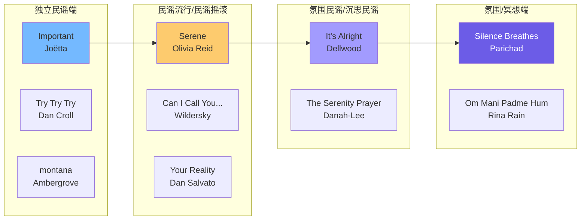
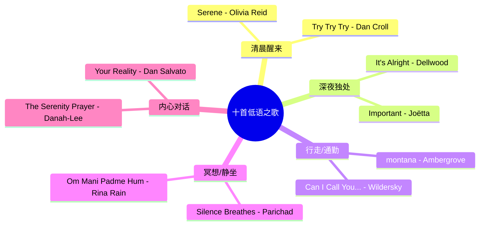
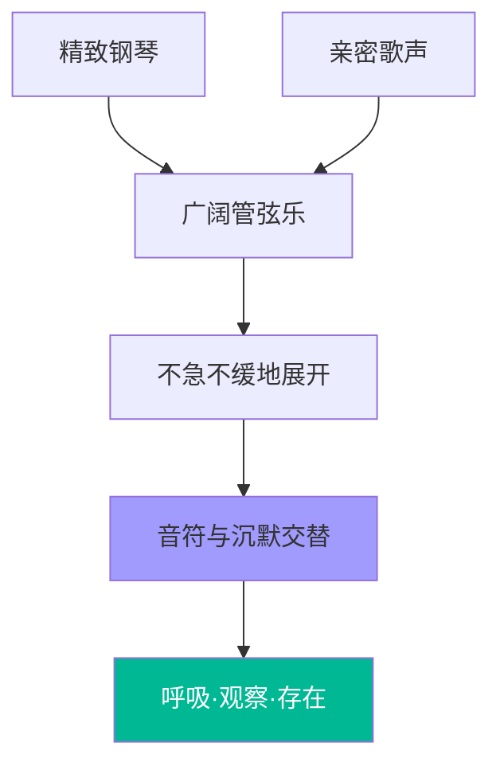
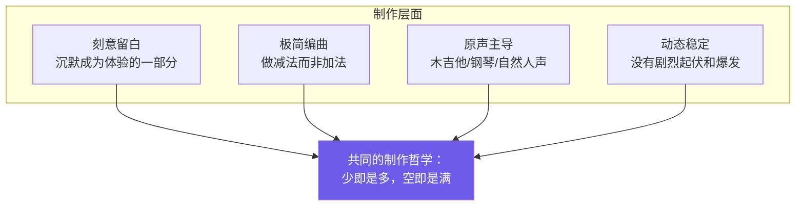
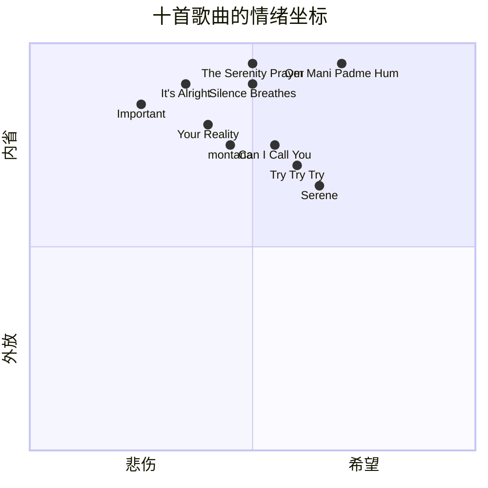
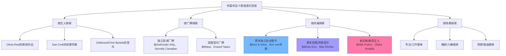
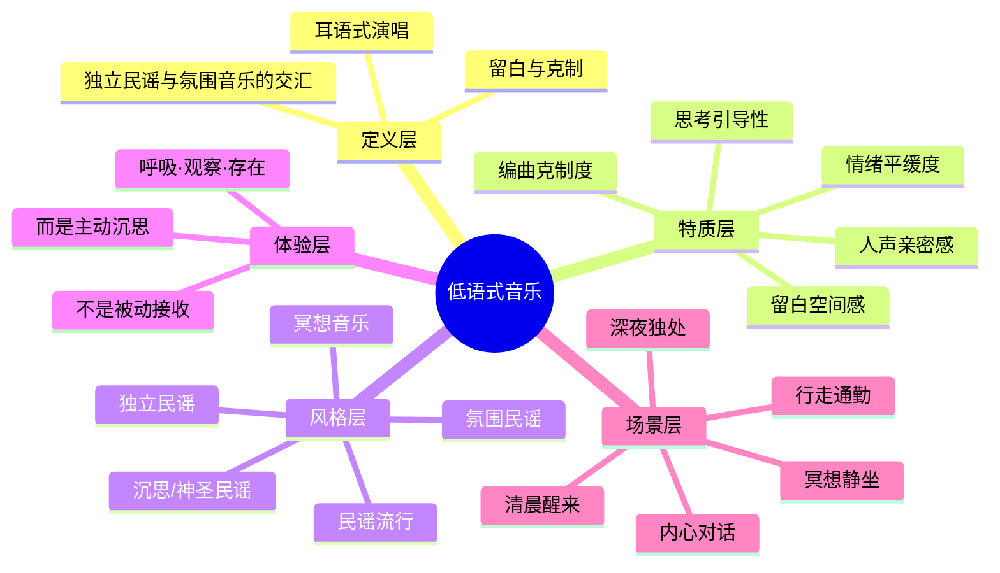

# 低语式民谣：十首引人沉思的宁静之声

::: tip 核心命题
这类歌曲的共同特质不是"好听"，而是"留白"——用克制的编曲和亲密的人声，为听者创造思考与呼吸的空间。
:::

## 一、核心定位：什么是"低语式"音乐

### 1.1 风格定义

你所寻找的"语调轻柔、情绪平缓、引人思考"的歌曲，本质上属于**独立民谣（Indie Folk）**和**氛围音乐（Ambient Music）**交汇地带中那些"低语式（Whisper-style）"的作品。它们不以旋律的华丽或节奏的冲击力取胜，而是通过**克制的编曲、亲密的人声、大量的留白**，营造出一种适合沉思与内省的听觉空间。

### 1.2 低语式音乐的五大特质

```mermaid
radar
    title 低语式音乐的五大特质维度
    axis 人声亲密感, 编曲克制度, 情绪平缓度, 留白空间感, 思考引导性
    "低语式民谣" : 95, 90, 92, 88, 90
    "普通流行歌" : 50, 40, 55, 20, 30
    "纯氛围音乐" : 30, 95, 98, 95, 70
```

| 特质 | 具体表现 | 反面（不是什么） |
|:---|:---|:---|
| **人声亲密感** | 耳语式、呼吸主导、不加修饰的真挚人声，仿佛歌手在你耳边轻声诉说 | 不是高亢嘹亮的演唱，不是炫技的高音，不是经过重度修音的"完美人声" |
| **编曲克制度** | 极简的乐器编配（指弹吉他、稀疏钢琴、细碎打击乐），刻意做减法 | 不是层层叠加的华丽编曲，不是大编制管弦乐，不是电子音效的堆砌 |
| **情绪平缓度** | 全程动态稳定，没有剧烈的情绪起伏和高潮爆发，像一条平静流动的河 | 不是先抑后扬的"炸裂式"歌曲，不是情绪过山车，不是催人泪下的煽情歌 |
| **留白空间感** | 制作上刻意留出沉默和呼吸的间隙，让音符之间的"空"成为体验的一部分 | 不是从头到尾填满声音的"墙式"制作，不是没有呼吸感的密集编曲 |
| **思考引导性** | 歌词和氛围引导听者进入内省状态，不是被动接收而是主动沉思 | 不是洗脑式的循环副歌，不是让人跟着跳舞的节奏，不是单纯的背景音 |

### 1.3 这类音乐的听觉体验模型


---

## 二、风格谱系：独立民谣与氛围音乐的交汇

### 2.1 十首歌曲的风格分布

这10首歌曲并非同一种风格，而是分布在从"纯民谣"到"纯氛围"的连续谱系上：



### 2.2 风格标签统计

| 风格标签 | 出现次数 | 代表歌曲 | 风格特征 |
|:---|:---:|:---|:---|
| **独立民谣** | 5 | Important、Try Try Try、montana、Serene、Can I Call You | 原声吉他主导，个人化表达，非商业主流制作 |
| **氛围音乐** | 3 | Silence Breathes、It's Alright、Om Mani Padme Hum | 注重空间感和音色层次，旋律性弱化，氛围主导 |
| **民谣流行** | 2 | Serene、Your Reality | 民谣基底但有流行歌曲的结构和可听性 |
| **民谣摇滚** | 1 | Can I Call You When The Winter's Done? | 民谣基础上加入轻摇滚元素，但仍保持克制 |
| **冥想音乐** | 2 | Silence Breathes、Om Mani Padme Hum | 专为冥想和内省设计，节奏极缓，重复性强 |
| **沉思/神圣民谣** | 2 | The Serenity Prayer、Om Mani Padme Hum | 带有精神性或宗教性主题，引导内心对话 |
| **原声带** | 1 | Your Reality | 为游戏/影视创作，带有叙事性和场景感 |

::: note 说明
一首歌曲可能同时属于多个风格标签，因此总数超过10。
:::

---

## 三、十首歌曲全景：按聆听场景分类

### 3.1 场景分类总览

不同的歌曲适合不同的聆听场景和情绪状态：



### 3.2 场景-歌曲匹配表

| 聆听场景 | 推荐歌曲 | 为什么适合 | 情绪关键词 |
|:---|:---|:---|:---|
| **清晨醒来** | Serene | "封装在声音里的阳光"，轻柔的吉他拨弦带来宁静的开启感 | 宁静、清新、冥想 |
| **清晨醒来** | Try Try Try | 不紧不慢的鼓和温暖吉他，温柔中透着希望，适合开启一天 | 温暖、克制、希望 |
| **深夜独处** | Important (Acoustic) | 极简指弹吉他+耳语式人声，关于悲伤中获得清晰认知，适合深夜内省 | 悲伤、清晰、亲密 |
| **深夜独处** | It's Alright | 写给艰难时刻的安魂曲，层次和声如"轻声细语的朋友在安慰你" | 安慰、内省、安魂 |
| **行走/通勤** | montana | 慢热的珍宝，安静吉他和舒缓节奏，如观看旧家庭录像带的沉思感 | 沉思、记忆、舒缓 |
| **行走/通勤** | Can I Call You... | 一段"轻声的忏悔"，空间感十足，冬日里期待春天与和解 | 诚恳、坚韧、期待 |
| **冥想/静坐** | Silence Breathes | 用音乐塑造的"安静时刻"，邀请你单纯地"呼吸、观察和存在" | 呼吸、观察、临在 |
| **冥想/静坐** | Om Mani Padme Hum | 冥想引导而非传统歌曲，缓慢稳定重复观音心咒，为临在和洞见创造空间 | 临在、洞见、内省 |
| **内心对话** | The Serenity Prayer | 对"宁静祈祷"的沉思性演绎，引导内心对话，温柔的冥想而非大胆宣告 | 诚实、冥想、对话 |
| **内心对话** | Your Reality | 原点之作，简单钢琴和真挚不加修饰的人声，所有上述歌曲共有的核心特质 | 真挚、沉思、原点 |

---

## 四、逐首深度解读

### 4.1 独立民谣端

#### ① 《Serene》- Olivia Reid

| 维度 | 详情 |
|:---|:---|
| **风格** | 独立民谣 / 民谣流行 |
| **核心意象** | "封装在声音里的阳光" |
| **编曲特点** | 制作刻意留白，轻柔的吉他拨弦和细碎的打击乐 |
| **人声特质** | 为声音和歌词留出充分的"思考空间" |
| **聆听体验** | 完美契合"宁静"和"冥想"感，像清晨第一缕阳光照进房间 |


---

#### ② 《Important (Acoustic)》- Joëtta

| 维度 | 详情 |
|:---|:---|
| **风格** | 独立民谣 |
| **主题** | 在悲伤中获得清晰认知 |
| **编曲特点** | 极简的指弹吉他，几乎没有其他乐器 |
| **人声特质** | 亲密的耳语式人声，乐评称"歌曲在音乐和动态上全程保持着稳定的水平" |
| **聆听体验** | 平稳感正是"不会让人兴奋"的聆听体验，适合深夜独自面对自己的情绪 |

::: note 关于 Acoustic（原声版）
指不使用电声乐器和电子效果，仅用原声乐器（木吉他、钢琴等）和自然人声演绎的版本。Acoustic版本通常比原版更极简、更亲密，因为剥离了电声编曲的"包装"。
:::

---

#### ③ 《Try Try Try》- Dan Croll

| 维度 | 详情 |
|:---|:---|
| **风格** | 独立民谣 / 灵魂民谣 |
| **核心意象** | "歌曲本身会呼吸" |
| **编曲特点** | 由不紧不慢的鼓和温暖的原声吉他推动，回归原声本源 |
| **人声特质** | 温柔，略带伤感，但克制与真诚中又透着一丝希望 |
| **聆听体验** | 情感表达十分内敛，不是宣泄式的，而是像一个人安静地跟自己说"再试试" |

---

#### ④ 《montana》- Ambergrove

| 维度 | 详情 |
|:---|:---|
| **风格** | 美国民谣 / 独立民谣 |
| **核心意象** | "慢热的珍宝"、"观看旧家庭录像带" |
| **编曲特点** | 安静的吉他、舒缓的节奏，从不刻意吸引你的注意 |
| **人声特质** | 亲密的歌声，像在回忆往事时轻声哼唱 |
| **聆听体验** | 在不知不觉中赢得你的心，营造出"沉思与记忆"的氛围，适合散步或通勤时听 |

::: note 关于全小写歌名
`montana`使用全小写而非首字母大写的"Montana"，这是独立音乐中常见的命名方式，传递一种非正式、私密、反主流的态度。全小写歌名暗示这不是一首"大歌"，而是一段私人的低语。
:::

---

### 4.2 民谣流行/民谣摇滚端

#### ⑤ 《Can I Call You When The Winter's Done?》- Wildersky

| 维度 | 详情 |
|:---|:---|
| **风格** | 独立民谣摇滚 |
| **核心意象** | "一段轻声的忏悔" |
| **编曲特点** | 空间感十足，民谣基础上加入轻摇滚元素但仍保持克制 |
| **人声特质** | "不会呐喊或高飞，而是轻柔地萦绕"，充满冬日里期待春天与和解的诚恳与坚韧 |
| **聆听体验** | 像在寒冷的冬天给一个很久没联系的人写信，字里行间是克制的思念和对和解的期待 |

::: note 关于长歌名
这首歌的歌名本身就是一句话——"Can I Call You When The Winter's Done?"（春天来临时我能给你打电话吗？）。独立民谣中常见这种叙事性长歌名，歌名本身就是歌曲情绪的浓缩，像一句未寄出的信的开头。
:::

---

#### ⑥ 《Your Reality》- Dan Salvato

| 维度 | 详情 |
|:---|:---|
| **风格** | 原声带 / 独立流行 |
| **来源** | 游戏《Doki Doki Literature Club!》的插曲 |
| **编曲特点** | 简单的钢琴伴奏，几乎没有其他乐器 |
| **人声特质** | 真挚、不加修饰，像一个人在空房间里对着你唱歌 |
| **聆听体验** | 原点之作——所有上述歌曲共有的核心特质的最佳代表，简单到极致反而最有力量 |

::: note 关于原声带（OST）
Original Soundtrack，指为电影、游戏、电视剧等视听作品创作的配乐和歌曲。原声带歌曲通常带有强烈的叙事性和场景感，因为它是为特定故事场景服务的。《Your Reality》作为游戏插曲，其简单的钢琴和真挚人声与游戏中的情感场景深度绑定。
:::

---

### 4.3 氛围民谣/沉思民谣端

#### ⑦ 《It's Alright》- Dellwood

| 维度 | 详情 |
|:---|:---|
| **风格** | 氛围独立民谣 |
| **歌手** | Chris Bartels，嗓音是"轻柔的、以呼吸为主导的" |
| **核心意象** | "写给艰难时刻的一首安魂曲" |
| **编曲特点** | 有层次的和声，如同"一群轻声细语的朋友在安慰你" |
| **聆听体验** | 氛围亲密而内省，在你最艰难的时候，像有人轻轻拍着你的肩膀说"没事的" |

::: note 关于安魂曲（Requiem）
原本是天主教为死者举行的弥撒乐曲，风格庄重肃穆。在这里用来描述这首歌的抚慰功能——它不是让你振作起来的"打气歌"，而是像安魂曲一样接纳你的痛苦，温柔地陪伴你度过艰难时刻。
:::

---

#### ⑧ 《The Serenity Prayer》- Danah-Lee

| 维度 | 详情 |
|:---|:---|
| **风格** | 沉思民谣 / 神圣民谣 |
| **主题** | 对"宁静祈祷"的沉思性民谣演绎 |
| **编曲特点** | 稀疏的乐器，不被处理为大胆的宣告，而是一段"温柔的冥想" |
| **人声特质** | 亲密的歌声，创造了安静、诚实和呼吸的空间 |
| **聆听体验** | 引导你进行内心的对话，不是在听一首歌，而是在和自己对话 |

::: note 关于宁静祈祷（Serenity Prayer）
由美国神学家莱因霍尔德·尼布尔（Reinhold Niebuhr）撰写的著名祈祷文，核心内容是："上帝，请赐予我宁静，去接受我无法改变的；赐予我勇气，去改变我能改变的；赐予我智慧，去分辨这两者的区别。"这首歌是对这段祈祷文的音乐化沉思。
:::

---

### 4.4 氛围/冥想端

#### ⑨ 《Silence Breathes》- Parichad

| 维度 | 详情 |
|:---|:---|
| **风格** | 氛围 / 冥想音乐 |
| **核心意象** | "用音乐塑造的安静时刻"，歌名本身就是"沉默在呼吸" |
| **编曲特点** | 精致的钢琴、广阔的管弦乐和亲密的歌声，不急不缓地展开 |
| **人声特质** | 让每一个音符和每一次沉默都成为体验的一部分 |
| **聆听体验** | 邀请你单纯地去"呼吸、观察和存在"，不是在听歌，而是在体验一段安静的时光 |



---

#### ⑩ 《Om Mani Padme Hum》- Rina Rain

| 维度 | 详情 |
|:---|:---|
| **风格** | 冥想 / 颂歌 |
| **核心意象** | "冥想引导"而非传统歌曲 |
| **编曲特点** | 缓慢而稳定地重复观音心咒，为"临在和洞见"创造空间 |
| **人声特质** | Rina Rain轻柔、明亮的嗓音，像引导冥想的导师的声音 |
| **歌词内容** | 带有"我爱自己，我爱我的生活"等积极内省的思考 |
| **聆听体验** | 不是在欣赏音乐，而是在被引导进入冥想状态，适合静坐、瑜伽、睡前 |

::: note 关于观音心咒（Om Mani Padme Hum）
藏传佛教中最著名的咒语，是观世音菩萨的真言。"Om"象征宇宙原始之声，"Mani"意为珍宝，"Padme"意为莲花，"Hum"象征不可分割的智慧。持诵此咒被认为能开启慈悲与智慧。这首歌将宗教咒语转化为冥想音乐，去除了宗教仪式感，保留了其引导内省的功能。
:::

---

## 五、共性特质提炼：十首歌的共同DNA

### 5.1 制作层面的共性



### 5.2 人声层面的共性

| 共性特质 | 具体表现 | 代表歌曲 |
|:---|:---|:---|
| **耳语式演唱** | 声音轻柔，像在耳边说话而非唱歌 | Important、It's Alright |
| **呼吸主导** | 能听到歌手的呼吸，人声与呼吸融为一体 | It's Alright、Silence Breathes |
| **不加修饰** | 没有重度修音和效果处理，保留人声的自然质感 | Your Reality、Important |
| **克制表达** | 情感不宣泄，而是内敛地、缓缓地释放 | Try Try Try、Can I Call You |
| **亲密距离** | 录音的近距离感，像歌手就在你身边而非舞台上 | 全部十首 |

### 5.3 情绪层面的共性



::: note 观察
所有歌曲都落在"内省"象限（y轴偏高），这正是这类音乐的核心——它们不追求让你情绪外放，而是引导你向内走。
:::

### 5.4 歌词主题的共性

| 主题方向 | 具体内容 | 代表歌曲 |
|:---|:---|:---|
| **自我对话** | 与自己的内心对话，反思和觉察 | The Serenity Prayer、Om Mani Padme Hum |
| **悲伤与接纳** | 面对悲伤，不是逃避而是接纳和理解 | Important、It's Alright |
| **记忆与怀旧** | 对过去的回忆，温柔地回望 | montana、Your Reality |
| **希望与坚持** | 在困难中保持希望，温柔地鼓励自己 | Try Try Try、Can I Call You |
| **宁静与存在** | 单纯地体验当下，呼吸、观察、存在 | Serene、Silence Breathes |

---

## 六、聆听建议：如何与这类音乐共处

### 6.1 不同场景的聆听方式

```mermaid
flowchart LR
    subgraph 主动聆听
        A1[戴上耳机<br/>闭上眼睛] --> A2[专注于人声的呼吸<br/>和编曲的留白]
        A2 --> A3[让思绪自然流动<br/>不刻意控制]
    end
    
    subgraph 背景聆听
        B1[低音量播放<br/>作为环境音] --> B2[阅读/写作/工作时<br/>营造宁静氛围]
        B2 --> B3[偶尔被某句歌词<br/>或某个音符触动]
    end
    
    subgraph 冥想聆听
        C1[静坐/瑜伽/睡前<br/>选择冥想类曲目] --> C2[跟随呼吸<br/>让音乐引导注意力]
        C2 --> C3[进入临在状态<br/>体验"存在"本身]
    end
    
    style A3 fill:#74b9ff
    style B3 fill:#fdcb6e
    style C3 fill:#00b894,color:#fff
```

### 6.2 推荐聆听顺序（入门到深入）

如果你是第一次接触这类音乐，建议按以下顺序循序渐进：

| 阶段 | 推荐曲目 | 理由 | 聆听状态 |
|:---:|:---|:---|:---|
| **入门** | Your Reality → Serene | 最容易进入的两首，旋律性较强，Your Reality是原点参照 | 放松地听，不需要刻意做什么 |
| **适应** | Try Try Try → montana | 开始体验"慢热"和"留白"，需要一点耐心 | 可以边做别的事边听，让音乐慢慢浸润 |
| **深入** | Important → It's Alright | 进入更私密、更内省的层面，需要独处的环境 | 戴上耳机，找一个安静的空间，专注聆听 |
| **沉浸** | Can I Call You → The Serenity Prayer | 最需要情感共鸣的两首，适合在特定心境下听 | 在你需要和自己对话的时候听 |
| **超越** | Silence Breathes → Om Mani Padme Hum | 最接近纯冥想的两首，超越了"歌曲"的概念 | 静坐、冥想、睡前，把音乐当作引导 |

---

## 七、延伸方向：从这十首歌出发

### 7.1 如果你喜欢这些，可以继续探索



### 7.2 同类艺人推荐参考

| 风格方向 | 代表艺人 | 代表作参考 | 与本次推荐的关联 |
|:---|:---|:---|:---|
| **独立民谣（低语式）** | Iron & Wine | 《Flightless Bird, American Mouth》 | 类似的耳语式人声和极简吉他编配 |
| **独立民谣（低语式）** | Bon Iver（早期） | 《Skinny Love》、《Flume》 | 类似的亲密感和内省气质，早期作品更极简 |
| **民谣流行（轻柔）** | Novo Amor | 《Anchor》、《Birthplace》 | 类似的空灵人声和氛围感编曲 |
| **氛围民谣** | José González | 《Heartbeats》、《Crosses》 | 类似的指弹吉他和克制人声 |
| **新古典/氛围** | Ólafur Arnalds | 《Near Light》、《Only The Winds》 | 类似的钢琴主导和广阔空间感 |
| **冥想/氛围** | Brian Eno | 《1/1》、《An Ending (Ascent)》 | 氛围音乐的奠基人，纯粹的氛围体验 |
| **神圣/沉思民谣** | Sufjan Stevens | 《Casimir Pulaski Day》、《Fourth of July》 | 类似的精神性主题和脆弱真挚的表达 |

---

## 八、总结：低语式音乐的完整认知框架

### 8.1 五维认知地图



### 8.2 十首歌曲速查表

| # | 歌曲 | 歌手 | 风格 | 一句话描述 | 最佳场景 |
|:---:|:---|:---|:---|:---|:---|
| 1 | Serene | Olivia Reid | 独立民谣/民谣流行 | 封装在声音里的阳光 | 清晨醒来 |
| 2 | Important (Acoustic) | Joëtta | 独立民谣 | 悲伤中获得清晰认知的耳语 | 深夜独处 |
| 3 | It's Alright | Dellwood | 氛围独立民谣 | 写给艰难时刻的安魂曲 | 深夜独处 |
| 4 | montana | Ambergrove | 美国民谣/独立民谣 | 观看旧家庭录像带般的沉思 | 行走通勤 |
| 5 | Silence Breathes | Parichad | 氛围/冥想音乐 | 用音乐塑造的安静时刻 | 冥想静坐 |
| 6 | Can I Call You When The Winter's Done? | Wildersky | 独立民谣摇滚 | 一段轻声的忏悔 | 行走通勤 |
| 7 | Try Try Try | Dan Croll | 独立民谣 | 会呼吸的灵魂民谣 | 清晨醒来 |
| 8 | The Serenity Prayer | Danah-Lee | 沉思民谣/神圣民谣 | 温柔的冥想而非大胆宣告 | 内心对话 |
| 9 | Om Mani Padme Hum | Rina Rain | 冥想/颂歌 | 冥想引导而非传统歌曲 | 冥想静坐 |
| 10 | Your Reality | Dan Salvato | 原声带/独立流行 | 原点之作，所有特质的集大成 | 内心对话 |

### 8.3 一句话总结

> 这些歌都更注重**氛围的营造**和**情绪的细腻传达**。它们的共同秘密是：**用最少的声音，创造最大的空间**——让你在那个空间里，不是在听歌，而是在和自己相处。

---

## 附录：专业术语释义表

| 术语 | 英文 | 所属领域 | 概念定义 | 起源/解决的问题 | 关键区分点 |
|:---|:---|:---:|:---|:---|:---|
| **独立民谣** | Indie Folk | 音乐风格 | 独立音乐框架下的民谣流派，以原声乐器为主、个人化表达为核心，不依赖主流商业唱片公司的制作和推广 | 1980-90年代，一批民谣音乐人脱离主流唱片公司，通过独立厂牌或自主发行音乐，追求创作自由和个人表达 | 强调"独立"（非商业主流）和"民谣"（原声/叙事/个人）；不同于主流民谣的商业化制作；与民谣摇滚有交集但更克制 |
| **氛围音乐** | Ambient Music | 音乐风格 | 一种注重音色、空间感和氛围营造而非旋律和节奏的音乐风格，常常作为环境的一部分而非注意力的焦点 | 1970年代由Brian Eno正式提出，他在《Music for Airports》专辑中定义了氛围音乐的概念："必须能够容纳多个层次的注意力，而不只是要求其中一个" | 旋律性弱化，音色和空间感主导；可以主动聆听也可以作为背景音；不同于背景音乐（BGM），氛围音乐有艺术意图 |
| **民谣流行** | Folk Pop | 音乐风格 | 民谣与流行音乐的融合流派，保留民谣的原声乐器和叙事性，同时采用流行歌曲的结构、旋律和制作方式 | 1960年代民谣复兴运动中，Bob Dylan等民谣歌手开始使用电声乐器和流行编曲，催生了民谣与流行的融合 | 比纯民谣更具可听性和流行潜力；比纯流行更具原声质感和叙事深度；是商业上最成功的民谣子流派 |
| **民谣摇滚** | Folk Rock | 音乐风格 | 民谣与摇滚的融合流派，使用民谣的词曲创作和叙事传统，结合摇滚的电声乐器、节奏和能量 | 1960年代中期，Bob Dylan在Newport民谣音乐节上使用电声乐队演出，被视为民谣摇滚的诞生标志 | 比民谣更有节奏感和能量；比摇滚更有叙事性和歌词深度；与独立民谣有交集但通常编制更大 |
| **指弹吉他** | Fingerstyle Guitar | 演奏技法 | 用手指（而非拨片）直接拨动琴弦的吉他演奏技法，可以同时演奏旋律、低音和和声，形成多层次的音乐效果 | 古典吉他和民间音乐中一直存在指弹传统，20世纪指弹吉他在民谣和乡村音乐中发展为独立的演奏风格 | 不用拨片，用手指的不同部位（拇指、食指、中指等）分别负责不同声部；可以一个人同时演奏旋律+伴奏；不同于扫弦（strumming） |
| **原声（不插电）** | Acoustic | 音乐制作 | 指使用原声乐器（木吉他、钢琴、弦乐等）而非电声乐器（电吉他、合成器等）和电子效果的音乐制作方式 | 1980-90年代，MTV的"Unplugged"系列节目让摇滚和流行歌手用原声乐器重新演绎自己的歌曲，"原声版"成为流行概念 | 强调乐器的自然音色和人声的真实质感；不同于电声版的厚重和效果处理；Acoustic版本通常更极简、更亲密 |
| **留白** | Negative Space / Musical Space | 音乐制作 | 指音乐中刻意保留的沉默、间隙和稀疏的编曲，让"没有声音的部分"成为音乐体验的重要组成 | 源自视觉艺术中的"负空间"概念，在音乐中对应为音符之间的沉默和乐器编排上的克制；爵士、古典、氛围音乐中广泛运用 | 不是"没写好"或"制作简陋"，而是刻意的艺术选择；留白让听者有思考和呼吸的空间；与"墙式制作"（Wall of Sound）相对 |
| **动态范围** | Dynamic Range | 音频工程 | 指音乐中最响和最轻之间的音量差异范围，动态范围大意味着有明显的轻重对比，动态范围小意味着全程音量接近 | 黑胶唱片和CD时代有不同的动态范围限制；"响度战争"（Loudness War）导致现代流行音乐动态范围被压缩，全程都很响 | 低语式音乐通常动态范围小且偏轻，全程保持稳定的音量水平；不同于"先轻后响"的爆发式歌曲；动态范围小不等于没有层次 |
| **冥想音乐** | Meditation Music | 音乐功能 | 专门为冥想、静坐、瑜伽等内省活动设计的音乐，通常节奏极缓、重复性强、旋律简单，目的是引导注意力和安定心神 | 古老的宗教音乐（佛教梵呗、基督教圣咏、印度拉格）都有冥想功能；现代冥想音乐作为一个独立品类在新世纪音乐（New Age）和氛围音乐中发展 | 功能性大于艺术性，目的是引导冥想而非欣赏音乐；通常没有传统歌曲的结构（主歌-副歌）；重复性强，让注意力不被旋律变化带走 |
| **颂歌/咒语** | Mantra / Chant | 宗教音乐 | 反复念诵的神圣音节、词语或短语，在佛教、印度教等宗教中被认为具有精神力量，通过声音的重复引导意识进入特定状态 | 源自印度教和佛教的古老修行传统，"Om Mani Padme Hum"是藏传佛教中最著名的观音心咒；现代将咒语转化为冥想音乐 | 不是传统意义上的"歌曲"（没有叙事性歌词）；通过重复产生沉浸感；声音本身被视为有力量，不只是载体 |
| **原声带** | Original Soundtrack (OST) | 音乐品类 | 为电影、电视剧、游戏等视听作品创作的配乐和歌曲，包括背景音乐、主题曲、插曲等，与作品的叙事和场景深度绑定 | 电影诞生后就有配乐传统，1920年代好莱坞开始系统创作电影配乐；游戏原声带随电子游戏产业发展成为独立品类 | 带有强烈的叙事性和场景感；脱离原作单独听时可能带有额外的情感联想；不同于独立创作的专辑歌曲 |
| **独立流行** | Indie Pop | 音乐风格 | 独立音乐框架下的流行音乐，保留流行音乐的旋律性和可听性，但在制作和发行上保持独立，追求个人化表达 | 1980年代英国独立音乐场景中诞生，C86合辑被视为独立流行的起点；区别于主流流行的商业化制作 | 比独立民谣更具旋律性和流行结构；比主流流行更具个人化和实验性；Your Reality属于这一风格的极简分支 |
| **神圣民谣** | Sacred Folk | 音乐风格 | 带有宗教或精神性主题的民谣音乐，将神圣文本或祈祷转化为民谣形式的音乐表达，通常氛围肃穆而内省 | 源自基督教赞美诗（Hymn）和民间宗教音乐传统；现代神圣民谣去除了教会仪式的形式感，保留精神性内容，以个人化方式表达 | 不同于传统宗教音乐的仪式感和合唱形式；以民谣的个人化方式处理神圣主题；氛围通常安静、内省、诚实 |
| **沉思民谣** | Contemplative Folk | 音乐风格 | 以引导沉思和内省为目的的民谣音乐，编曲极简、节奏舒缓、歌词具有哲理性或反思性，适合安静地聆听和思考 | 源自民谣音乐中的"抗议歌曲"和"反思歌曲"传统；现代沉思民谣弱化了社会批判，强化了个人内省和精神探索 | 不同于叙事民谣（讲故事）和抗议民谣（社会批判）；核心功能是引导听者进入沉思状态；编曲和人声都极度克制 |
| **美国民谣** | American Folk | 音乐风格 | 美国本土的民谣音乐传统，包括阿巴拉契亚民谣、乡村民谣、抗议民谣等子流派，以木吉他、班卓琴、口琴等乐器为特征，强调叙事和个人表达 | 源自欧洲移民带来的民谣传统与美国本土文化的融合；20世纪初通过John Lomax等人的田野录音被记录和保存；60年代民谣复兴运动使其进入主流 | 有强烈的美国地域文化特征（乡村、公路、小镇、回忆）；不同于英国民谣的凯尔特传统；montana的"旧家庭录像带"感正是美国民谣的怀旧特质 |
| **编曲** | Arrangement | 音乐制作 | 为一首歌曲选择和编配乐器、决定各乐器的演奏方式和层次、设计歌曲的整体声音结构的过程 | 歌曲最初可能只是旋律+歌词（如吉他弹唱），编曲决定了它最终听起来是什么样——用什么乐器、什么节奏、什么层次 | 不同于作曲（写旋律和和声）；编曲决定"怎么演奏这首歌"；低语式音乐的编曲核心是"做减法"——用最少的乐器达到最大的氛围 |
| **制作人** | Producer | 音乐制作 | 负责音乐录音和制作的整体把控者，决定歌曲的声音风格、编曲方向、录音方式和最终混音效果，是音乐制作的核心角色 | 早期唱片制作人主要负责技术层面的录音；1960年代起制作人开始参与艺术创作决策，成为歌曲声音的"导演" | 不同于录音师（负责技术操作）；制作人决定歌曲的整体声音方向；低语式音乐的制作人核心决策是"留白"和"克制" |
| **混音** | Mixing | 音频工程 | 将多轨录音中的各个音轨（人声、吉他、鼓等）调整音量、声像、效果，混合成最终的立体声轨道的过程 | 多轨录音技术出现后，需要将分别录制的各个乐器混合成一个整体；混音决定了各乐器的相对音量和空间位置 | 不同于母带处理（Mastering，对最终立体声做整体优化）；混音决定"各乐器之间的关系"；低语式音乐的混音强调人声的近距离感和乐器的空间感 |
| **和声** | Harmony | 音乐理论 | 两个或多个不同音高的声音同时发声所形成的音响效果，包括和弦、和声进行、人声和声等，是音乐纵向结构的基础 | 单音旋律只能表达横向线条，和声为音乐增加了纵向的厚度和情感色彩；It's Alright中"一群轻声细语的朋友"指的就是多层人声和声 | 不同于旋律（Melody，单音的横向线条）；和声是"同时发声的多个音"；低语式音乐常用稀疏而温暖的和声增加亲密感 |
| **新世纪音乐** | New Age | 音乐风格 | 1970-80年代兴起的一种融合性音乐风格，融合了氛围音乐、世界音乐、古典音乐和电子音乐，常用于冥想、放松和疗愈场景 | 作为对摇滚和流行音乐的反拨，新世纪音乐追求宁静、和谐和精神性；Windham Hill等厂牌推动了这一风格的发展 | 不同于氛围音乐的实验性；新世纪音乐更旋律化、更"好听"；功能性强（放松、冥想、疗愈）；Om Mani Padme Hum和Silence Breathes带有新世纪音乐特质 |
| **临在** | Presence / Mindfulness | 冥想/心理学 | 指全然地、不带评判地觉察当下的体验，包括身体感受、情绪和思维，是正念冥想的核心状态 | 源自佛教的正念（Mindfulness）传统，20世纪由Jon Kabat-Zinn引入主流心理学和医疗领域，发展为正念减压疗法（MBSR） | 不是"什么都不想"，而是"觉察当下发生的一切"；是低语式冥想音乐引导听者进入的核心状态；与"走神"或"放空"不同 |
