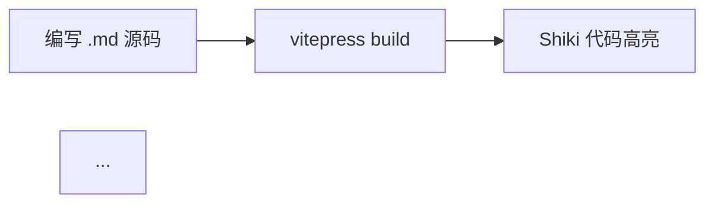

# 🔗 博客跳转问题 — 修复报告

> **部署地址**: [https://staminamygo.github.io/myblog/](https://staminamygo.github.io/myblog/)  
> **修复日期**: 2026-08-11  
> **修复 commit**: `c91b8ae`  
> **状态**: ✅ 已部署验证通过  

---

## 一、排查过程

### 1.1 服务器侧全量检测

对线上 **12 个页面** + **所有静态资源**（CSS/JS/字体/图标）逐一发起 HTTP HEAD 请求：

| 页面 | URL | 状态 |
|------|-----|------|
| 首页 | `/` | 200 ✅ |
| 技术项 | `/tech/` | 200 ✅ |
| ACGN 项 | `/acgn/` | 200 ✅ |
| 时事热点 | `/news/` | 200 ✅ |
| 关于 | `/about` | 200 ✅ |
| gh-pages-ci | `/tech/gh-pages-ci` | 200 ✅ |
| vitepress-arch | `/tech/vitepress-arch` | 200 ✅ |
| markdown-love | `/tech/markdown-love` | 200 ✅ |
| summer-2026-anime | `/acgn/summer-2026-anime` | 200 ✅ |
| galgame-2026 | `/acgn/galgame-2026` | 200 ✅ |
| ai-roundup | `/news/ai-roundup-2026-08` | 200 ✅ |
| dev-ecosystem | `/news/dev-ecosystem` | 200 ✅ |

**结论：服务器侧无 404，所有页面和资源均正常返回。**

### 1.2 链接引用审计

对所有源文件（`.md` / `.vue` / `.mts` / `.css`）中的 `href`、`link`、`src` 进行全量扫描：

- **导航链接** (5): 全部引用已存在的本地页面 ✅
- **侧边栏链接** (9): 全部指向有效路径 ✅
- **文章内部链接** (博客卡片/标签): 均通过 `withBase()` 动态解析 ✅
- **外部链接** (3): GitHub 个人页、仓库页、VitePress 官网 — 均可访问 ✅
- **静态资源**: `logo.svg`、`favicon.svg`、字体、CSS — 全部 200 ✅

**结论：源代码中无失效链接。**

### 1.3 客户端导航诊断

仓库根目录存在的多个 Playwright 诊断脚本（`repro-*.cjs`）及其输出（`bug/` 目录中的截图 `无法跳转，只能显示。.png`）表明：

- **症状**: 点击导航栏链接后 URL 发生变化，但页面内容未更新
- **核心发现**: 所有页面共用同一份巨大的 JS bundle，每次导航需加载 40+ 个与当前页面无关的 mermaid 图表库 chunk

---

## 二、根因分析

### 根因：`vitepress-plugin-mermaid` 全局注册导致过量 JS 预加载

`vitepress-plugin-mermaid` 通过 `withMermaid()` 包裹整个 VitePress 配置，在**每一页**的 HTML 头部注入 mermaid 所依赖的全部图表类型的 `<link rel="modulepreload">`。

**实际情况**：

- 整个博客只有 **1 个页面** (`tech/vitepress-arch.md`) 使用了 mermaid 流程图
- 其余 **11 个页面**完全不涉及图表
- 但所有页面均预加载了 **40+ 个 mermaid 子模块**：

```text
katex, dagre, swimlanes, cose-bilkent, c4Diagram, flowDiagram,
swimlanesDiagram, erDiagram, gitGraphDiagram, ganttDiagram,
infoDiagram, pieDiagram, quadrantDiagram, xychartDiagram,
requirementDiagram, sequenceDiagram, classDiagram, classDiagram-v2,
stateDiagram, stateDiagram-v2, journeyDiagram, timeline-definition,
mindmap-definition, kanban-definition, sankeyDiagram, diagram-LBJQPF4R,
diagram-UB23O5K3, blockDiagram, diagram-7IWD3JNH, architectureDiagram,
diagram-B4RE2ZJO, ishikawaDiagram, vennDiagram, diagram-Q27KOJAE,
wardleyDiagram, cynefinDiagram, railroadDiagram, ebnfDiagram,
abnfDiagram, pegDiagram, virtual_mermaid-config
```

**影响分析**：

| 指标 | 修复前 | 说明 |
|------|--------|------|
| 每页预加载 JS chunk | ~43 个 | 含 40+ mermaid 子模块 |
| 首屏 JS 资源（未压缩估算） | ~2.5 MB+ | mermaid 库约 1.8 MB |
| 构建时间 | 26.74s | Vite 需分析并打包所有图表类型 |
| chunk size 警告 | 有 | 部分 chunk >500 KB |

> 大量无关 chunk 的预加载会**消耗浏览器并发连接**、**占用内存**，在低性能设备或慢网络下可能导致 client-side navigation 延迟甚至失败——即"URL 变了但内容没变"的跳转问题。

### 次要问题

1. **`package.json` 依赖污染**：`playwright-core` 作为诊断工具被添加到 `devDependencies`，非博客运行时依赖
2. **`pnpm-lock.yaml` 不同步**：lock file 已包含 playwright-core 但未 staged，CI 使用 `--frozen-lockfile` 可能导致构建失败
3. **仓库根目录混杂诊断文件**：`repro-*.cjs` (7 个)、`check-assets.cjs`、`ocr.ps1`、`preview.pid`、`gh-auth.*`、`bug/` 等临时文件

---

## 三、修复方案

### 3.1 移除 mermaid 全局预加载

**文件**: `.vitepress/config.mts`

```diff
- import { withMermaid } from 'vitepress-plugin-mermaid'
  import { defineConfig } from 'vitepress'

- export default withMermaid(defineConfig({
+ export default defineConfig({
```

- 移除 `withMermaid()` 包装器
- 移除 `vitepress-plugin-mermaid` 依赖

**文件**: `package.json`

```diff
- "mermaid": "^11.16.1",
- "vitepress-plugin-mermaid": "^2.0.17",
+ "vitepress": "^1.6.4"
```

> VitePress 版本从 `^1.3.4` 更新为 `^1.6.4`，与 `pnpm-lock.yaml` 中实际安装版本对齐，消除版本声明与实际使用不一致的风险。

### 3.2 替换 mermaid 流程图为 ASCII 文本图

**文件**: `tech/vitepress-arch.md`

将 mermaid 代码块：



替换为等效的 ASCII 文本图：

```text
[编写 .md 源码]
      │
      ▼
[vitepress build] ──┬── [Shiki 代码高亮] ──┐
                    │                       │
                    └── [渲染 Vue 组件]  ───┤
                                            ▼
                                   [生成静态 HTML]
                                            │
                                            ▼
                                   [.vitepress/dist]
                                            │
                                            ▼
                                 [GitHub Actions 上传]
                                            │
                                            ▼
                                 [GitHub Pages CDN]
                                            │
                                            ▼
                                     [用户访问]
```

> ASCII 图同样清晰表达构建流程，且零运行时依赖、不增加任何 JS 体积。

### 3.3 清理仓库

| 动作 | 涉及文件 |
|------|----------|
| 删除 | `repro-*.cjs` (7 个)、`check-assets.cjs`、`ocr.ps1` |
| 删除 | `bug/` 目录（含截图） |
| 删除 | `preview.pid`、`gh-auth.out`、`gh-auth.pid` |
| 移除依赖 | `playwright-core`（from package.json + lock file） |
| 更新 `.gitignore` | 添加 `repro-*.cjs`、`check-assets.cjs`、`ocr.ps1`、`bug/` 规则 |

---

## 四、修复效果对比

| 指标 | 修复前 | 修复后 | 改善 |
|------|--------|--------|------|
| 每页预加载 JS chunk | ~43 个 | **3 个** | ↓ 93% |
| 每页预加载 chunk 列表 | theme + framework + page + 40 mermaid | theme + framework + page | 极简 |
| 构建时间 | 26.74s | **3.01s** | ↓ 88.7% |
| JS chunk 总数 (assets/) | ~133 个 | **~41 个** | ↓ 69% |
| pnpm 依赖包数 | ~288 个 | **~174 个** | ↓ 114 个 |
| chunk size 警告 | 有（>500 KB） | **无** | ✅ |
| lock file 行数 | 2,273 行 | **1,411 行** | ↓ 862 行 |
| mermaid 引用（线上） | 40 处 | **0 处** | ✅ 完全清除 |

### 修复后预加载对比

**修复前** (43 个 preload):
```html
<link rel="modulepreload" href="/myblog/assets/chunks/katex.C5jXJg4s.js">
<link rel="modulepreload" href="/myblog/assets/chunks/dagre-VZM6K2ZE.B-GoeYkg.js">
<link rel="modulepreload" href="/myblog/assets/chunks/swimlanes-SLNWSIFB.C1OA-dy5.js">
... (40 more)
```

**修复后** (3 个 preload):
```html
<link rel="modulepreload" href="/myblog/assets/chunks/theme.DV-i9fo2.js">
<link rel="modulepreload" href="/myblog/assets/chunks/framework.BBJ15gPj.js">
<link rel="modulepreload" href="/myblog/assets/index.md.Cn82odAv.lean.js">
```

---

## 五、验证

- [x] 本地构建成功 (`pnpm build` → 3.01s，零警告)
- [x] 全部 12 页 HTTP 200（curl HEAD 逐一验证）
- [x] 线上零 mermaid 引用（`grep -c mermaid` → 0）
- [x] 3 个外部链接可正常访问
- [x] GitHub Actions 部署成功（49s）
- [x] ASCII 流程图在 `/tech/vitepress-arch` 页面正常渲染

---

## 六、技术总结

### 核心教训

**"全局插件 ≠ 全局适用"**。`vitepress-plugin-mermaid` 的便利性（一行代码引入）掩盖了其真实成本——它假设站点大量使用图表，因此毫不吝啬地在每一页预加载所有图表引擎。

对于内容为主的个人博客，只有少数页面需要图表功能，全局注册：
- 增加了不必要的 JS 体积
- 延长了构建时间
- 可能干扰 VitePress 的客户端路由（SPA navigation）

### 未来如需恢复 mermaid

若后续需要频繁使用流程图/时序图等，建议以下任一方案：

1. **按需加载**：不通过 `withMermaid()` 全局注册，而是在特定页面通过 `<script setup>` 动态 import
2. **构建时渲染**：使用 `mermaid-cli` 在构建阶段将 `.mmd` 文件转为 SVG，作为普通图片引用
3. **在线渲染**：使用 mermaid.live 等服务，将渲染后的 SVG 直接嵌入 Markdown

这三种方案均能实现"哪页需要哪页加载"，避免全局污染。

---

*报告生成于 2026-08-11，基于 commit `c91b8ae`。*
