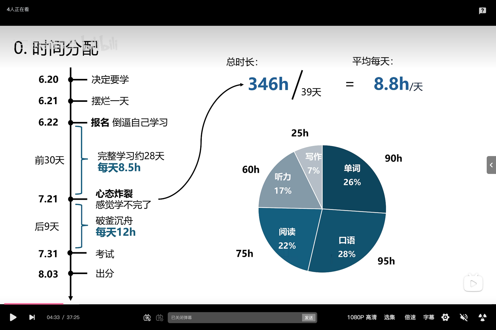
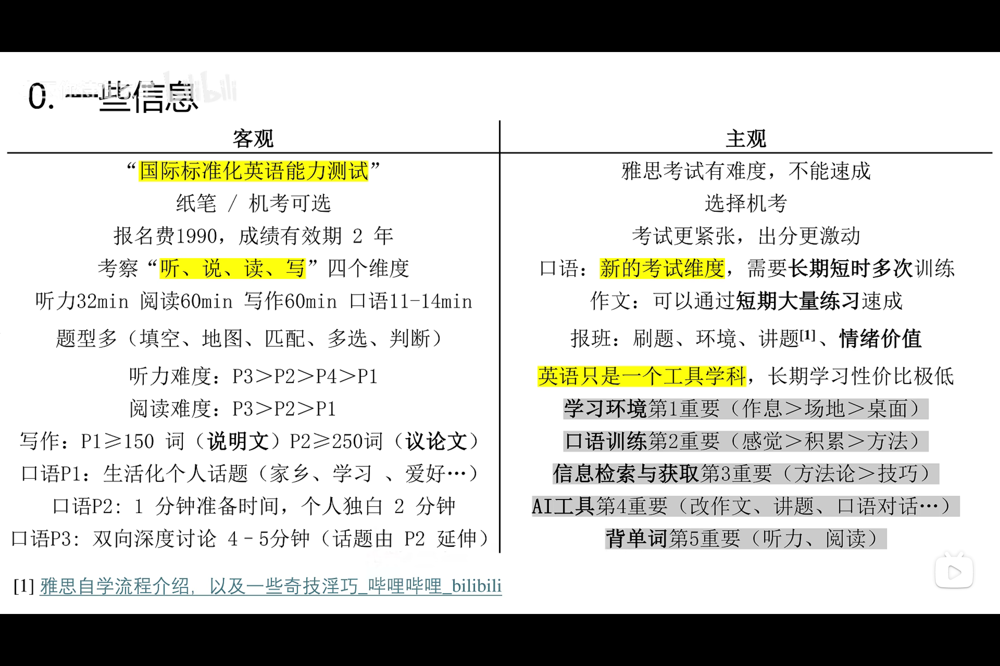
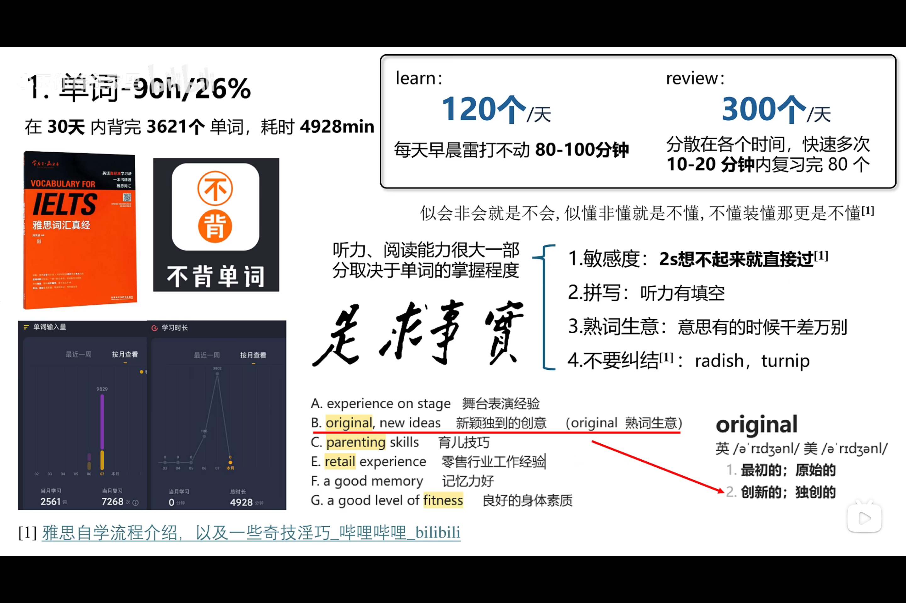
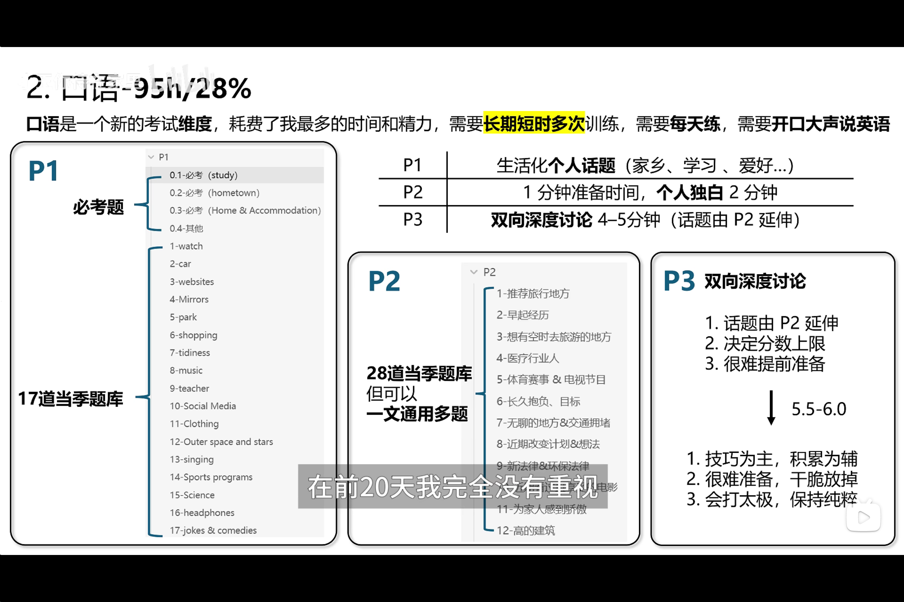
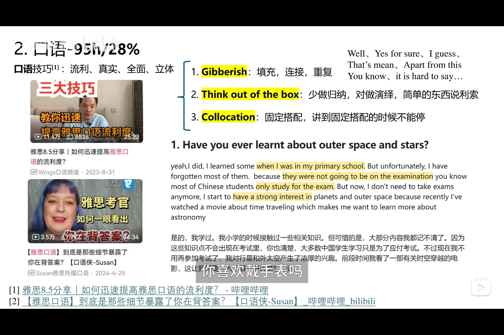
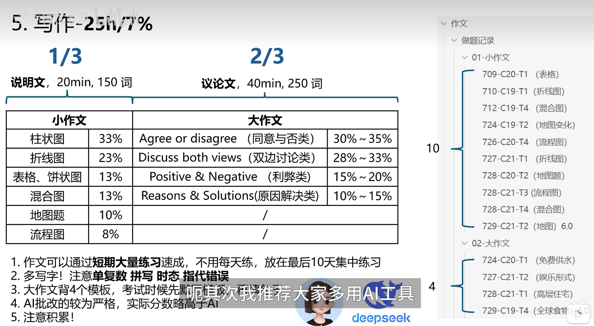

# 雅思备考策略

::: note 说明
以下为备考阶段整理的笔记截图，按板块归档，便于回顾与查漏补缺。
:::

## 时间分配

本节整理每日备考的时间安排与精力分配思路，明确各时段的任务重心。

## 基本信息

本节记录考试的基本信息、流程与各项要求，作为备考的整体框架参考。

## 单词

本节汇总词汇背诵的量级、记忆方法与重点词表，是听力与阅读的基础。

## 口语

本节聚焦口语训练的材料选择、练习方法与评分要点，包含两张笔记截图。

## 写作

本节整理写作训练的构思方式、批改要点与常见注意事项。

