# 什么是ERP：从MRP演进到企业资源一体化的管理系统

::: tip 核心命题
ERP不是一套软件，而是一种以"资源全局统筹、数据唯一来源、业务流程驱动"为核心的企业管理思想，软件只是其载体。
:::

## 一、核心定义：ERP到底是什么

### 1.1 一句话定义

**ERP（Enterprise Resource Planning，企业资源计划）** 是一套面向企业的集成化管理信息系统，核心是把企业所有资源统一管理——人力、财务、采购、生产、库存、销售、供应链等，打通各部门数据，消除信息孤岛，实现业务流程一体化。

### 1.2 定义的三个关键词拆解

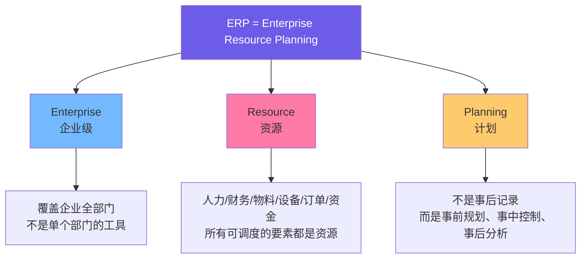

| 关键词 | 英文 | 含义 | 反面（不是什么） |
|:---|:---|:---|:---|
| **Enterprise** | 企业级 | 覆盖企业全部门、全业务流程的集成系统 | 不是单个部门的工具（如纯财务软件、纯库存软件） |
| **Resource** | 资源 | 人力、资金、物料、设备、订单、信息等所有可调度要素 | 不只是物料或库存，资源的范畴远大于"货物" |
| **Planning** | 计划 | 事前规划需求、事中控制执行、事后分析优化 | 不是事后的记账工具或数据录入系统 |

### 1.3 ERP的本质：思想 > 软件

很多人把ERP等同于"一套软件"，这是理解上的偏差。ERP的本质是**管理思想**，软件是承载这种思想的工具。

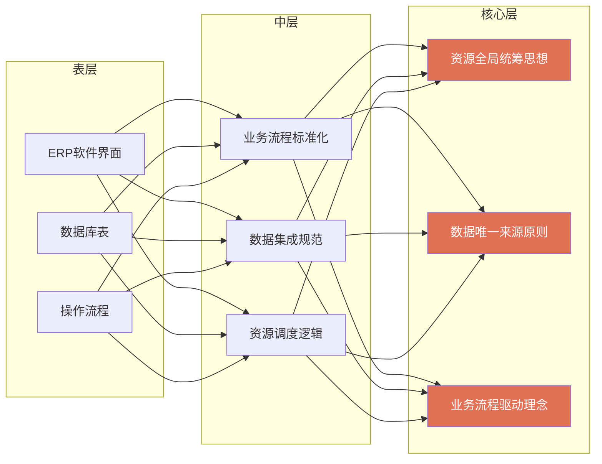

---

## 二、概念演进史：从MRP到ERP的三代跃迁

### 2.1 演进时间线

ERP不是凭空出现的，它经历了三代演进，每一代都在解决上一代的局限。

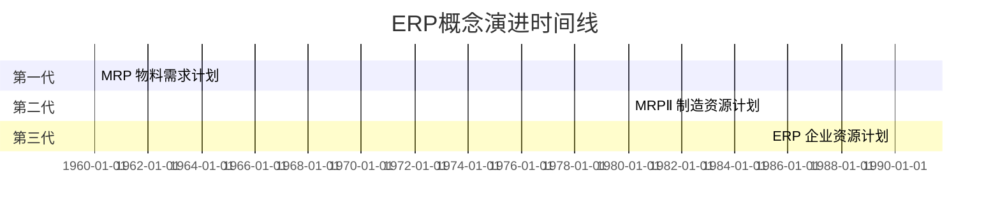

### 2.2 三代系统的核心差异

| 代际 | 名称 | 英文全称 | 提出时间 | 管理范围 | 核心解决的问题 | 局限性 |
|:---:|:---|:---|:---:|:---|:---|:---|
| **第一代** | MRP | Material Requirements Planning | 1960s | 物料 | 根据产品结构（BOM）和订单，算出需要什么物料、需要多少、什么时候需要 | 只考虑物料，不考虑产能和资金；算出的需求可能超出生产能力 |
| **第二代** | MRPⅡ | Manufacturing Resource Planning | 1980s | 制造资源（物料+产能+财务） | 在MRP基础上加入产能平衡和财务集成，实现"物流与资金流统一" | 仍局限于制造企业内部，没有覆盖销售、人力、供应链等企业全部资源 |
| **第三代** | ERP | Enterprise Resource Planning | 1990年Gartner提出 | 企业全部资源 | 打破部门壁垒，覆盖财务、采购、生产、库存、销售、人力、供应链，实现全企业数据一体化 | 实施复杂、成本高；需要企业流程标准化改造 |

### 2.3 演进的内在逻辑：范围不断扩大

```mermaid
flowchart LR
    subgraph MRP
        R1[物料]
    end
    
    subgraph MRPⅡ
        R2[物料]
        R3[产能]
        R4[财务]
    end
    
    subgraph ERP
        R5[物料]
        R6[产能]
        R7[财务]
        R8[人力]
        R9[销售]
        R10[采购]
        R11[供应链]
    end
    
    R1 -->|加入产能和财务| R2
    R2 -->|加入销售/人力/供应链| R5
    
    style R1 fill:#74b9ff
    style R4 fill:#a29bfe
    style R11 fill:#fd79a8
```

::: note 关于 Gartner
1990年由美国咨询公司Gartner Group正式提出ERP概念。Gartner是全球知名的IT研究与顾问咨询公司，其提出的技术概念和魔力象限（Magic Quadrant）在行业内有广泛影响力。
:::

---

## 三、三大核心思想

ERP的灵魂不在于它有多少模块，而在于三条贯穿始终的核心思想。

### 3.1 思想一：资源全局统筹

**企业的资金、物料、设备、人力、订单都属于资源，ERP对其做统一规划调度。**

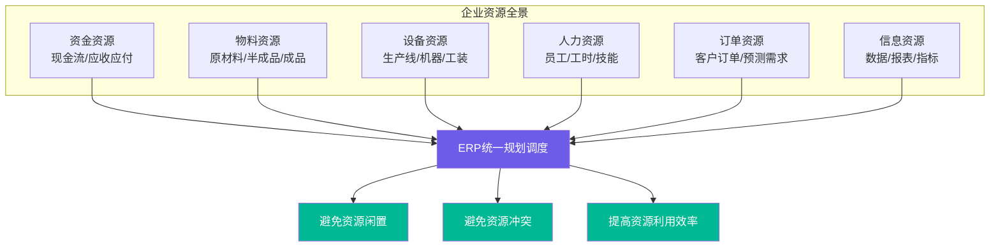

**没有ERP时的资源调度问题**：
- 销售接了大单，但不知道生产车间有没有产能
- 采购买了大量原料，但财务账上没钱付款
- 生产排了计划，但关键设备正在维修
- 各部门各自为政，资源冲突无人协调

### 3.2 思想二：数据唯一来源（Single Source of Truth）

**一套数据全部门共用。销售录入订单，采购、生产、财务自动拿到这份订单数据，不用各部门重复录表、Excel来回传。**

```mermaid
flowchart TB
    subgraph 没有ERP：信息孤岛
        A1[销售部<br/>Excel订单表] -->|手动复制| A2[仓库部<br/>Excel出库表]
        A2 -->|手动复制| A3[生产部<br/>Excel生产计划表]
        A3 -->|手动复制| A4[财务部<br/>Excel凭证表]
        A1 -.->|数据不一致| A5[各部门数字对不上<br/>月底对账痛苦]
    end
    
    subgraph 有ERP：数据唯一来源
        B1[销售录入订单<br/>一次录入] --> B2[(ERP中央数据库)]
        B2 --> B3[仓库自动看到订单<br/>准备出库]
        B2 --> B4[生产自动看到订单<br/>排产]
        B2 --> B5[财务自动看到订单<br/>生成凭证]
        B2 --> B6[管理层自动看到报表<br/>实时经营数据]
    end
    
    style A5 fill:#ff6b6b,color:#fff
    style B2 fill:#00b894,color:#fff
```

| 维度 | 没有ERP（Excel孤岛） | 有ERP（数据唯一来源） |
|:---|:---|:---|
| **数据录入** | 各部门重复录入同一份数据 | 一次录入，全部门共享 |
| **数据一致性** | 各部门Excel版本不同，数字对不上 | 中央数据库，所有人看到同一份数据 |
| **数据时效性** | Excel来回传，延迟数小时到数天 | 实时同步，业务发生即更新 |
| **对账成本** | 月底财务与业务对账，耗时耗力 | 业务自动生成财务数据，无需对账 |
| **错误率** | 手动复制粘贴，容易出错 | 系统自动流转，人为错误大幅减少 |

### 3.3 思想三：业务流程驱动

**业务发生自动流转。一个环节的动作自动触发下一个环节，不需要人工通知和传递。**

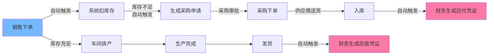

::: note 关键区别
传统模式下，销售下单后要打电话通知仓库、仓库要发邮件通知生产、生产要填表通知财务——每个环节都靠人工传递。ERP模式下，业务动作本身就是触发器，系统自动完成流转。
:::

---

## 四、ERP主要模块全景

### 4.1 模块全景图

不同厂商模块略有差异，但通用核心模块如下：

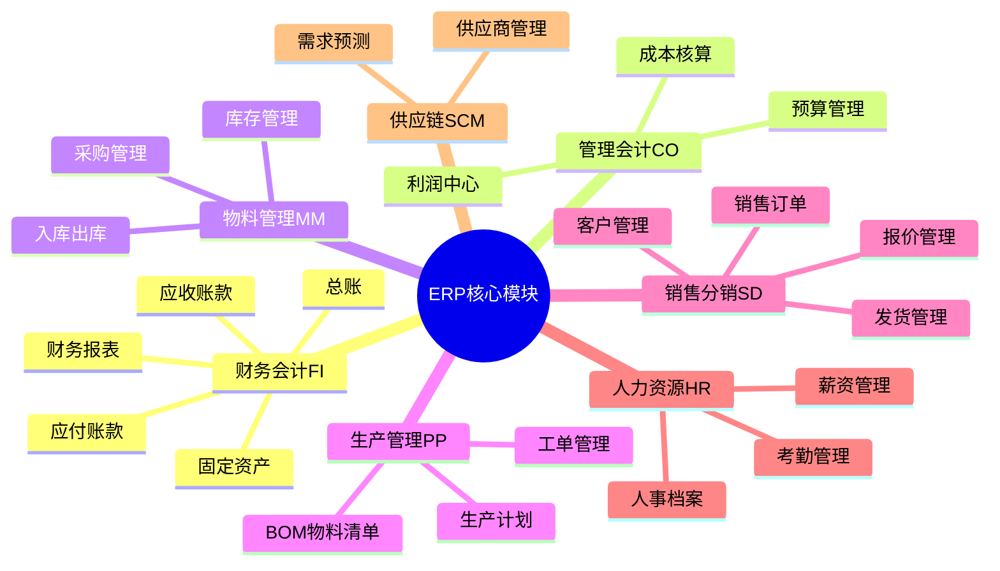

### 4.2 各模块详解

| 模块 | 英文缩写 | 英文全称 | 核心功能 | 在企业中的角色 |
|:---|:---:|:---|:---|:---|
| **财务会计** | FI | Financial Accounting | 总账、应收、应付、固定资产、报表 | 企业的"账本"，记录所有财务交易，对外出具财务报表 |
| **管理会计** | CO | Controlling | 成本核算、利润中心、预算 | 企业的"仪表盘"，为内部管理提供成本分析和预算控制 |
| **物料管理** | MM | Materials Management | 采购、入库出库、库存管理 | 企业的"仓库管家"，管物料从采购到入库到领用的全生命周期 |
| **生产管理** | PP | Production Planning | BOM物料清单、生产计划、工单管理 | 企业的"生产调度员"，根据订单和产能安排生产 |
| **销售分销** | SD | Sales and Distribution | 客户、报价、销售订单、发货 | 企业的"前台"，管从客户接触到订单到发货的全流程 |
| **人力资源** | HR | Human Resources | 人事档案、薪资、考勤 | 企业的"人事部门"，管员工信息和薪酬 |
| **供应链** | SCM | Supply Chain Management | 供应商管理、需求预测 | 企业的"上下游协调员"，管供应商关系和需求预测 |

### 4.3 模块间的数据流转关系

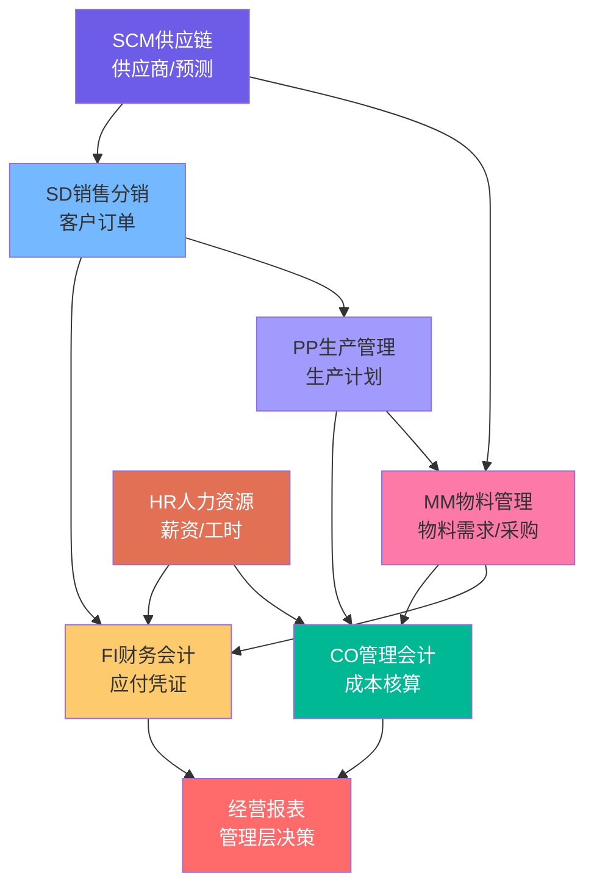

---

## 五、ERP能解决什么问题

### 5.1 四大核心价值

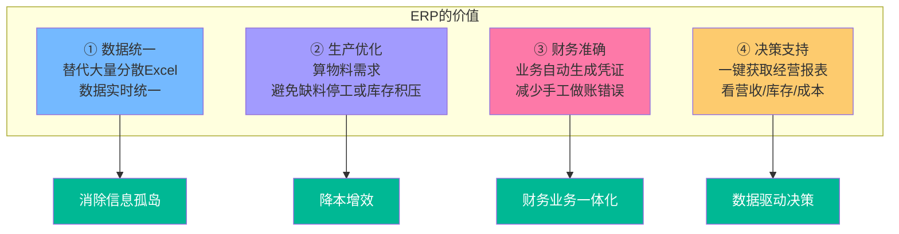

### 5.2 问题-解决方案对照表

| 企业痛点 | 没有ERP时的表现 | ERP的解决方案 | 量化收益方向 |
|:---|:---|:---|:---|
| **数据分散** | 各部门Excel满天飞，版本混乱，数字对不上 | 中央数据库，一次录入全部门共享 | 减少对账时间，数据一致性提升 |
| **缺料停工** | 生产到一半发现原料不够，紧急采购，停工待料 | MRP运算自动算物料需求，提前生成采购申请 | 减少停工时间，降低紧急采购溢价 |
| **库存积压** | 不知道库存有多少，重复采购，仓库堆满呆滞料 | 实时库存可视，需求驱动采购，避免多买 | 降低库存资金占用，减少呆滞料 |
| **手工做账** | 财务根据业务单据手工录凭证，容易出错，月底加班 | 业务发生自动生成财务凭证，无需手工录入 | 减少财务错误，缩短结账周期 |
| **决策滞后** | 管理层要看经营数据，需要各部门填表汇总，等一周 | 实时经营报表，一键查看营收、库存、成本 | 决策从"事后看"变为"实时看" |
| **流程混乱** | 各部门按自己的习惯做事，流程不标准，新人难上手 | ERP内置标准化业务流程，强制按流程走 | 流程标准化，降低对个人经验的依赖 |

---

## 六、常见产品分类与选型

### 6.1 三大产品梯队

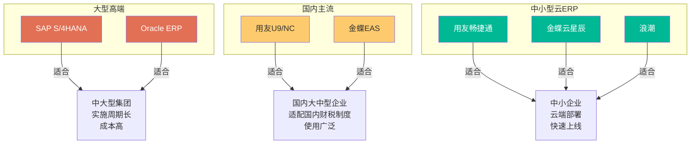

### 6.2 产品对比表

| 梯队 | 代表产品 | 目标客户 | 实施周期 | 成本 | 优势 | 劣势 |
|:---|:---|:---|:---|:---|:---|:---|
| **大型高端** | SAP S/4HANA | 中大型集团、跨国企业 | 6-18个月 | 数百万至数千万 | 功能最全、行业方案成熟、全球支持 | 实施复杂、成本高、需要专业团队维护 |
| **大型高端** | Oracle ERP | 中大型集团、跨国企业 | 6-18个月 | 数百万至数千万 | 数据库技术强、云原生架构好 | 国内本地化不如SAP/用友/金蝶 |
| **国内主流** | 用友U9/NC | 国内大中型企业 | 3-12个月 | 数十万至数百万 | 适配国内财税制度、本地化服务好 | 高端功能与SAP有差距 |
| **国内主流** | 金蝶EAS | 国内大中型企业 | 3-12个月 | 数十万至数百万 | 界面友好、云转型快、中小客户基础好 | 超大型集团方案不如SAP |
| **中小型云ERP** | 用友畅捷通 | 中小企业 | 1-4周 | 数千至数万/年 | 快速上线、成本低、云端维护 | 功能简化，不适合复杂生产 |
| **中小型云ERP** | 金蝶云星辰 | 中小企业 | 1-4周 | 数千至数万/年 | 易用性好、移动端强 | 复杂制造场景支持有限 |
| **中小型云ERP** | 浪潮 | 中小企业/国企 | 2-8周 | 数万至数十万 | 国企背景、政务领域强 | 市场化程度不如用友金蝶 |

### 6.3 选型决策框架

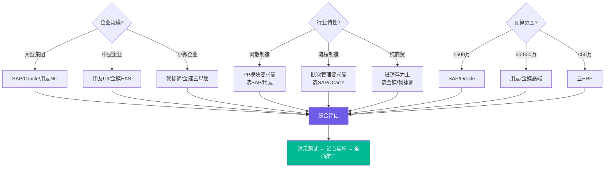

---

## 七、ERP ≠ 进销存：关键区分

### 7.1 概念对比

这是最常见的混淆点。进销存和ERP有本质区别，进销存只是ERP的一个子集。

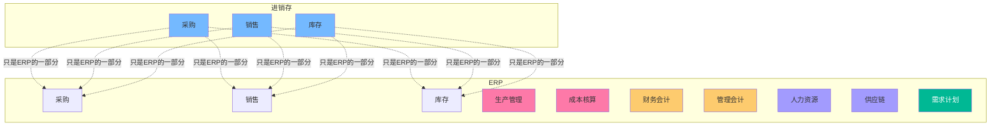

### 7.2 详细对比表

| 维度 | 进销存 | ERP |
|:---|:---|:---|
| **管理范围** | 采购、销售、库存三个环节 | 企业全部资源（财务、生产、人力、供应链等） |
| **目标客户** | 简单商贸小公司、个体户 | 完整企业运营，尤其是生产制造企业 |
| **生产管理** | 无（不管生产） | 有（BOM、生产计划、工单、车间管理） |
| **成本核算** | 简单的出库成本 | 完整的成本核算（料工费分摊、作业成本等） |
| **财务集成** | 可能有简单的收付款记录 | 完整的财务会计+管理会计，业务自动生成凭证 |
| **计划能力** | 无计划，只是记录 | 有MRP运算、需求预测、产能计划 |
| **数据深度** | 只管"进了多少、卖了多少、剩多少" | 管"为什么进、给谁用、成本多少、利润多少" |
| **典型用户** | 小卖部、贸易公司、小批发商 | 工厂、制造企业、集团公司 |

### 7.3 什么时候用进销存就够了

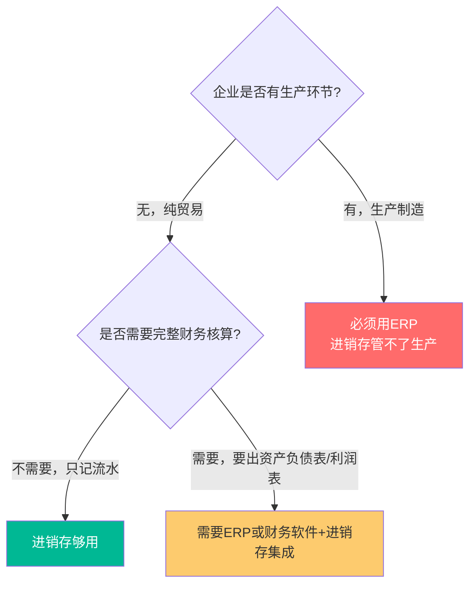

---

## 八、全流程实例：一张订单的ERP之旅

### 8.1 实例场景

**一家工厂接到客户100件产品订单，看ERP如何让全流程在一套系统内完成。**

### 8.2 流程逐步拆解

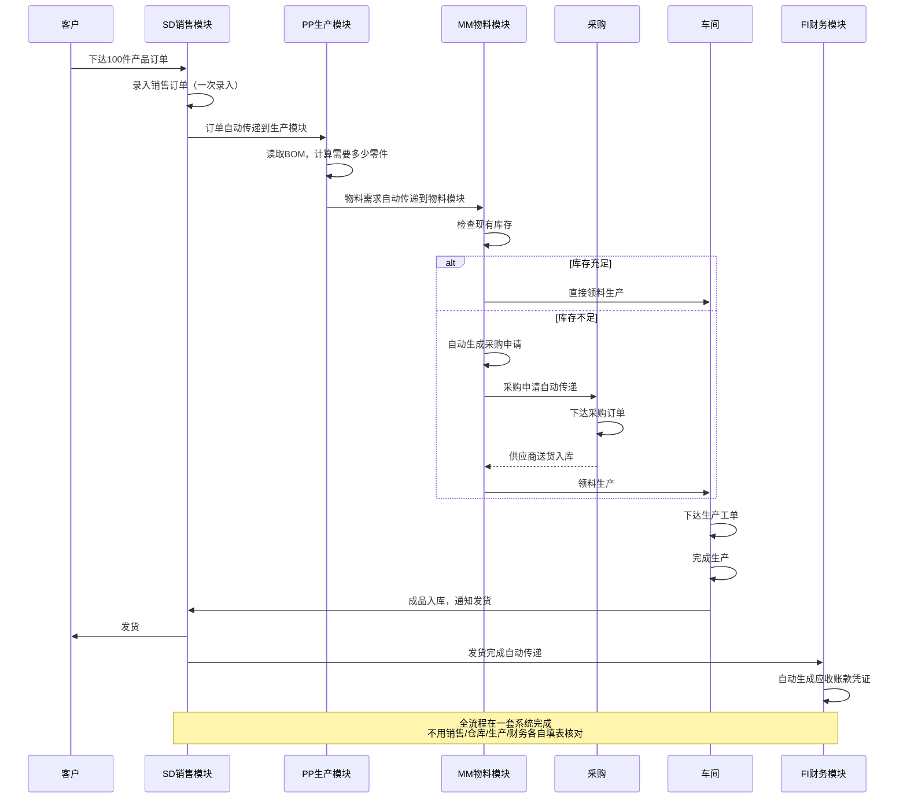

### 8.3 各环节的具体动作

| 步骤 | 执行模块 | 系统动作 | 人工操作 | 传统模式下需要做什么 |
|:---:|:---:|:---|:---|:---|
| 1 | SD | 录入销售订单 | 销售员录入客户、产品、数量、价格 | 销售员填Excel订单表，打印或发邮件给仓库 |
| 2 | PP | 读取BOM，计算物料需求 | 系统自动运算，无需人工 | 生产员手工查BOM表，算需要多少零件 |
| 3 | MM | 检查库存，不足则生成采购申请 | 系统自动检查，采购员审批采购申请 | 仓库员手工盘点库存，发现不够再打电话给采购 |
| 4 | MM/采购 | 采购下单→供应商送货→入库 | 采购员下单，仓库员确认入库 | 采购填采购单，货到后仓库填入库单，两边对账 |
| 5 | PP/车间 | 下达生产工单→生产完成→成品入库 | 车间主管派工，工人报工 | 生产员填生产计划表，车间填工单，完工后填入库单 |
| 6 | SD | 发货 | 仓库员发货确认 | 仓库填出库单，物流安排发货 |
| 7 | FI | 自动生成应收凭证 | 无需人工，财务审核即可 | 财务根据发货单手工录入会计凭证 |

::: note 对比结论
传统模式下，一张100件的订单需要至少7个部门各自填表、来回传递、反复对账；ERP模式下，数据一次录入，全流程自动流转，人工只需要在关键节点做审批和确认。
:::

---

## 九、总结：ERP的完整认知框架

### 9.1 五维认知地图

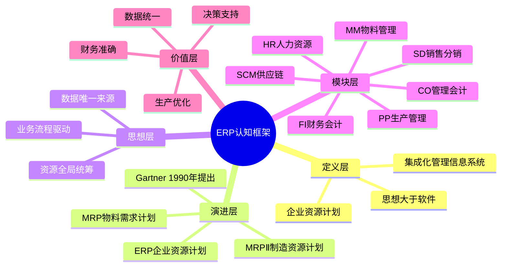

### 9.2 核心要点速查

| 维度 | 核心结论 |
|:---|:---|
| **是什么** | 面向企业的集成化管理信息系统，统一管理所有资源，打通部门数据 |
| **不是什么** | 不是进销存（进销存只是子集）、不是单纯的财务软件、不是Excel的替代品 |
| **从哪来** | 1990年Gartner提出，由MRP→MRPⅡ→ERP三代演进 |
| **核心思想** | 资源全局统筹、数据唯一来源、业务流程驱动 |
| **核心模块** | FI/CO/MM/PP/SD/HR/SCM七大模块 |
| **解决什么** | 数据分散、缺料停工、库存积压、手工做账、决策滞后、流程混乱 |
| **怎么选** | 大型选SAP/Oracle，国内大中型选用友/金蝶，中小企业选云ERP |
| **和进销存的区别** | 进销存只管采销存，ERP叠加生产、成本、财务、计划，面向完整企业运营 |

### 9.3 延伸学习方向

如需进一步区分，可以对比：**ERP、MRP、MRPⅡ、MES、OA** 的区别，方便记忆。

| 系统 | 全称 | 定位 | 与ERP的关系 |
|:---|:---|:---|:---|
| **ERP** | Enterprise Resource Planning | 企业级资源计划，管全企业 | 主体系统 |
| **MRP** | Material Requirements Planning | 物料需求计划，管物料 | ERP的前身/子集 |
| **MRPⅡ** | Manufacturing Resource Planning | 制造资源计划，管制造 | ERP的前身/子集 |
| **MES** | Manufacturing Execution System | 制造执行系统，管车间现场 | ERP的下游，ERP下计划，MES管执行 |
| **OA** | Office Automation | 办公自动化，管行政流程 | 与ERP互补，OA管行政审批，ERP管业务数据 |

---

## 附录：专业术语释义表

| 术语 | 英文 | 所属领域 | 概念定义 | 起源/解决的问题 | 关键区分点 |
|:---|:---|:---:|:---|:---|:---|
| **ERP** | Enterprise Resource Planning | 企业管理 | 面向企业的集成化管理信息系统，统一管理人力、财务、采购、生产、库存、销售、供应链等全部资源，打通部门数据，实现业务流程一体化 | 1990年Gartner提出，由MRP、MRPⅡ演进而来，解决企业部门间信息孤岛和资源无法全局统筹的问题 | 覆盖企业全部门全资源；是管理思想而非单纯软件；进销存只是其子集 |
| **MRP** | Material Requirements Planning | 生产管理 | 物料需求计划，根据产品结构（BOM）、库存和订单，计算出需要什么物料、需要多少、什么时候需要的计划方法 | 1960年代出现，解决制造企业"生产需要什么物料、何时采购"的问题，避免缺料停工或盲目采购 | 只管物料需求；不考虑产能和资金；是MRPⅡ和ERP的基础 |
| **MRPⅡ** | Manufacturing Resource Planning | 生产管理 | 制造资源计划，在MRP基础上加入产能平衡和财务集成，实现物流与资金流统一的制造企业管理系统 | 1980年代出现，解决MRP只算物料不算产能的问题，将生产、采购、销售、财务集成在制造企业范围内 | 覆盖制造企业的物料+产能+财务；仍局限于制造领域；是ERP的直接前身 |
| **Gartner** | Gartner Group | IT咨询 | 全球知名的IT研究与顾问咨询公司，总部位于美国，以技术趋势分析、魔力象限（Magic Quadrant）和行业研究报告闻名 | 1979年成立，为企业提供IT战略咨询和技术选型建议，其提出的技术概念在行业内有广泛影响力 | 是咨询公司而非软件厂商；1990年首次提出ERP概念；其魔力象限是企业软件选型的重要参考 |
| **BOM** | Bill of Materials | 生产管理 | 物料清单，描述产品结构的技术文件，列出构成产品的所有原材料、半成品、零件及其数量和装配关系 | 制造企业需要明确"做一个产品需要哪些零件、各多少"，BOM是MRP运算的基础输入 | 是产品结构的静态描述；分为单层BOM和多层BOM；是PP模块的核心主数据 |
| **FI** | Financial Accounting | 财务管理 | 财务会计模块，负责总账、应收账款、应付账款、固定资产和财务报表，是企业对外出具财务报告的核心 | 企业需要按会计准则记录所有财务交易并对外出具报表，FI模块标准化了这一流程 | 面向外部（投资者、税务、审计）；遵循会计准则；生成资产负债表、利润表等法定报表 |
| **CO** | Controlling / Management Accounting | 财务管理 | 管理会计模块，负责成本核算、利润中心分析和预算管理，为企业内部管理提供决策支持 | 企业管理者需要了解产品成本、部门利润和预算执行情况，CO模块提供内部管理视角的财务分析 | 面向内部（管理层）；不遵循法定会计准则；关注成本、利润、预算的分析与控制 |
| **MM** | Materials Management | 物料管理 | 物料管理模块，负责采购管理、入库出库、库存管理和物料需求计划的执行 | 企业需要管理物料从采购申请到入库到领用的全流程，MM模块统一了物料的物流管理 | 管物料的物理流动（采购→入库→领用）；与FI集成自动生成应付凭证；是PP生产的物料保障 |
| **PP** | Production Planning | 生产管理 | 生产管理模块，负责BOM管理、生产计划、工单管理和生产执行跟踪 | 制造企业需要根据订单和产能安排生产，PP模块将销售需求转化为可执行的生产计划 | 管"怎么生产、何时生产、生产多少"；核心是MRP运算和工单管理；只存在于有生产环节的企业 |
| **SD** | Sales and Distribution | 销售管理 | 销售分销模块，负责客户管理、报价、销售订单、发货和开票 | 企业需要管理从客户接触到订单到发货到收款的销售全流程，SD模块统一了销售业务 | 管"卖什么、卖给谁、收多少钱"；是ERP的订单入口；与FI集成自动生成应收凭证 |
| **HR** | Human Resources | 人力资源 | 人力资源模块，负责人事档案、薪资核算、考勤管理和组织管理 | 企业需要管理员工信息、薪酬和考勤，HR模块将人力资源管理数字化 | 管"人"的信息和成本；与CO集成将人工成本分摊到产品；与FI集成生成薪资凭证 |
| **SCM** | Supply Chain Management | 供应链管理 | 供应链管理模块，负责供应商管理、需求预测、采购协同和供应链计划 | 企业需要协调上下游供应商和客户，优化从原材料到成品的整个供应链，SCM模块提供供应链全局视图 | 管企业外部的上下游关系；比MM的采购范围更广；包含需求预测和供应商协同 |
| **信息孤岛** | Information Silo | 企业管理 | 指企业各部门的数据相互独立、无法共享，每个部门维护自己的数据，导致数据不一致和协作困难 | 企业信息化初期各部门独立建设系统（财务用财务软件、仓库用库存软件），系统间不互通，形成数据孤岛 | 是ERP要解决的核心问题之一；表现为数据重复录入、数字对不上、协作靠人工传递 |
| **数据唯一来源** | Single Source of Truth | 数据管理 | 指企业所有业务数据都存储在一个中央数据库中，各部门共享同一份数据，确保数据一致性和准确性 | 信息孤岛导致各部门数据不一致，需要一个统一的数据存储和共享机制，SSOT是数据治理的核心原则 | 是ERP的核心思想之一；一次录入全部门共享；消除数据冗余和不一致 |
| **业务流程驱动** | Business Process Driven | 企业管理 | 指以业务流程为核心，一个业务环节的完成自动触发下一个环节，系统按流程自动流转数据和任务 | 传统模式下各环节靠人工通知和传递，效率低且易出错，流程驱动让系统自动完成流转 | 是ERP的核心思想之一；业务动作即触发器；减少人工干预和传递成本 |
| **进销存** | Purchase-Sales-Inventory | 商贸管理 | 指对采购、销售、库存三个环节的管理，记录商品的进货、销售和库存数量，是商贸企业的基础管理工具 | 商贸企业需要管"进了多少、卖了多少、剩多少"，进销存软件满足这一基础需求 | 只管采销存三个环节；不管生产、成本、财务；是ERP的子集；适合纯贸易小公司 |
| **MES** | Manufacturing Execution System | 生产管理 | 制造执行系统，位于ERP计划层和车间设备控制层之间，负责车间生产现场的执行管理，包括工单派发、工序报工、质量检验、设备监控等 | ERP下达到车间的生产计划需要具体执行和跟踪，MES填补了"计划"与"设备"之间的执行层空白 | 管车间现场执行；比PP更细到工序和设备；与ERP互补（ERP下计划，MES管执行） |
| **OA** | Office Automation | 办公管理 | 办公自动化系统，负责行政流程审批、公文管理、会议管理、通知公告等日常行政办公事务 | 企业需要规范化行政流程和日常办公事务，OA系统提供无纸化办公平台 | 管行政流程而非业务数据；与ERP互补（OA管审批，ERP管业务）；核心是流程审批和协同办公 |
| **SAP S/4HANA** | SAP S/4HANA | ERP产品 | SAP公司的新一代ERP套件，基于HANA内存计算平台，支持实时数据分析和简化的数据模型，是当前SAP的旗舰ERP产品 | SAP R/3等旧一代ERP在大数据量下性能不足，S/4HANA利用内存计算实现实时处理，并简化了数据模型 | SAP旗舰产品；基于HANA内存数据库；适合中大型集团；实施成本高 |
| **用友** | Yonyou | ERP厂商 | 中国领先的企业管理软件和云服务提供商，产品覆盖NC（大型集团）、U9（中型制造）、畅捷通（小微企业）等多个系列 | 中国企业需要适配国内财税制度和本地化管理需求的ERP软件，用友是国内最大的ERP厂商之一 | 国内ERP龙头；产品线覆盖大中小微企业；适配中国财税制度；本地化服务好 |
| **金蝶** | Kingdee | ERP厂商 | 中国知名的企业管理软件厂商，产品覆盖EAS（大型集团）、云星空（中型企业）、云星辰（小微企业）等，云转型较早 | 中国企业需要灵活易用的管理软件，金蝶以界面友好和云产品著称，是国内主流ERP厂商之一 | 国内主流ERP厂商；云转型领先；易用性较好；中小客户基础深厚 |
| **实施周期** | Implementation Cycle | ERP项目 | 指从ERP项目启动到系统正式上线运行所需要的时间，包括需求调研、方案设计、系统配置、数据迁移、用户培训、测试和上线等阶段 | ERP不是开箱即用的软件，需要根据企业实际业务进行配置和定制，实施周期是ERP项目的重要管理指标 | 大型ERP实施周期6-18个月；中小型云ERP1-4周；实施周期与企业规模和复杂度正相关 |
| **主数据** | Master Data | 数据管理 | 指企业中相对稳定、被多个业务模块共享使用的基础数据，如物料主数据、客户主数据、供应商主数据、BOM等 | ERP各模块需要共享统一的基础数据，主数据是数据唯一来源的具体体现，主数据质量直接影响ERP运行效果 | 是相对静态的基础数据；被多个模块共享；主数据管理是ERP实施的关键环节 |
| **凭证** | Voucher / Accounting Entry | 财务会计 | 会计凭证，是记录经济业务、明确经济责任的书面证明，包括原始凭证和记账凭证，是登记账簿的依据 | 财务会计需要按会计准则记录每一笔经济业务，凭证是财务核算的最小单位，ERP中业务发生自动生成记账凭证 | 是财务核算的基础单位；ERP中业务自动生成凭证；分为应收、应付、转账等类型 |
